# ** Before readme **

Open VSCode -> Click Extension -> Search below -> Install

```bash
Markdown Preview Enhanced
```

```bash
Material Icon Theme
```

```bash
Path Intellisense
```

# Ultralyitcs YOLO Setup and Installation

This guide provides detailed steps to set up and install Ultralyitcs YOLO with CUDA Toolkit 11.7 and Anaconda for virtual environment management.


## Prerequisites

Before you begin, ensure that you have:

- **Python** installed for AI Development.
- **OBS Studio** installed for Video Stream.
- **NVIDIA GPU** with support for CUDA.
- **Anaconda** installed on your system (for virtual environment management).
- **CUDA Toolkit 11.7** installed.
- **[Ultralytics YOLO](https://docs.ultralytics.com/)** is an AI framework specialized in real-time object detection using Deep Learning.


## #Step 0: Install Python

- Open Command Console
- typing this in console:
  ```
  python --version
  ```

  - If you see a Python version (e.g., Python 3.12.x), as shown below:
    
    Then you can skip **`#Step 0`** and go to **`#Step 1`**
  - If no version is found, type the following command:

    ```
    python
    ```

    
    This prompt will  show the option to install Python 3.12 from the **Microsoft Store**:
    

    - Click **Get** to download.
    - Once downloaded, re-checking the Python version by typing:
      
    - After finish the installation, you can go to **`#Step 1`**


## #Step 1: OBS Studio (For virtual camera)
1 Visit OBS Studio website
   - Go to [Download OBS](https://obsproject.com/)
      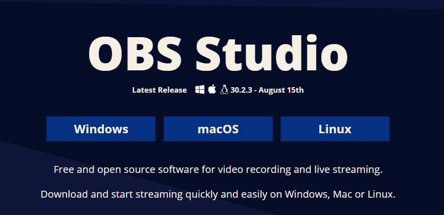
2. Installation
   - Follow the on-screen prompts to download and install OBS on your system.


## #Step 2: Install CUDA Toolkit 11.7

To leverage GPU acceleration, you need to install the CUDA Toolkit 11.7. Follow these steps:

1. Visit the [CUDA Toolkit 11.7 download page](https://developer.nvidia.com/cuda-11-7-0-download-archive) and select the version appropriate for your operating system.

   - select according to your pc or laptop 
      Windows --> x86_64 --> 10 --> exe (network)
     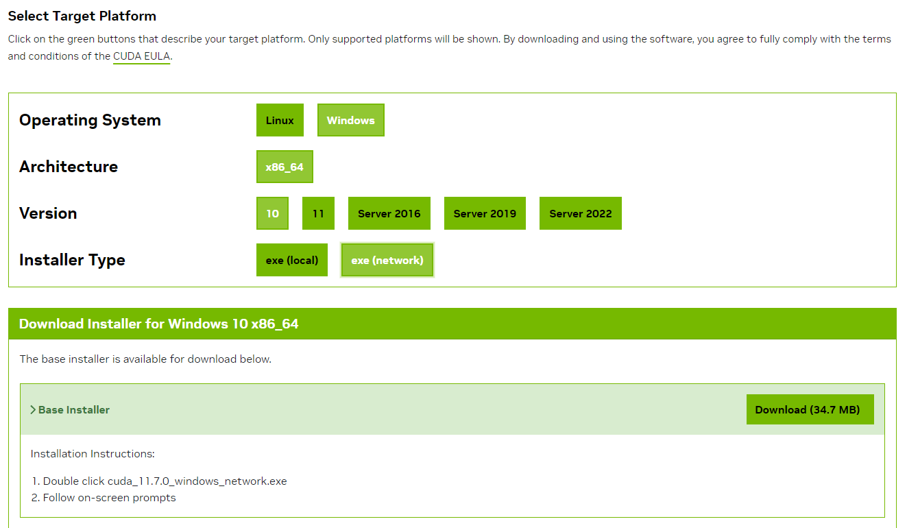
   - And follow on-screen prompts
2. Follow the installation instructions on the page. After installation, verify it by running:
   ```bash
   nvcc --version
   ```
   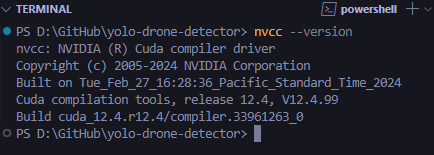
   This should return details of CUDA 11.7 if the installation was successful.


## Step 3: Install Anaconda

Anaconda will help manage your virtual environments. You can install Anaconda by following these steps:

1. Download the installer from the [Official Anaconda website downloader](https://www.anaconda.com/download/success).
2. Run the installer and follow the on-screen instructions.
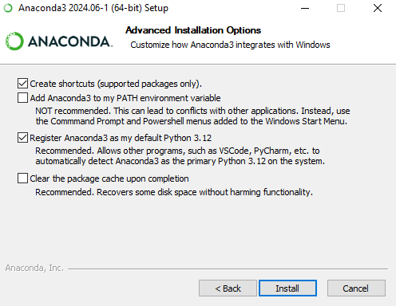
3. Verify the installation by running:

   ```bash
   conda --version
   ```
   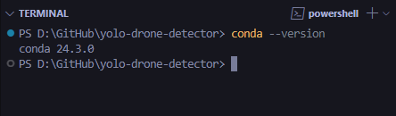


## Step 4: Set Up the Virtual Environment for Your Project
For detailed instructions, refer to the official [CONDA Documentation](https://conda.io/projects/conda/en/latest/user-guide/index.html)
1. Create a new Anaconda environment and install dependencies from the `requirements.txt` file:
   - to create conda command example:
      ```bash
      conda create --name <env-name>
      ```
   - to create new environment from scratch:
      ```bash
      conda create -n yolodrone-env python=3.9
      ```
   - to create new environment using a pre-configured environment.yml (if provided):
      ```bash
      conda env create -f environment.yml
      ```

2. Activate the Conda environment that you created
   - Check list all environments in Conda:
      ```bash
      conda info --envs
      ```
      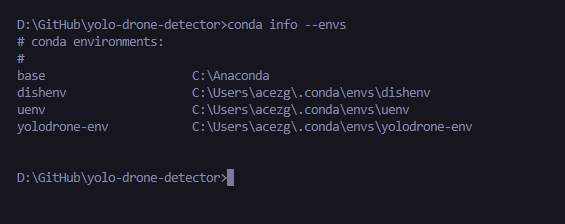

   - Activate your environment:
      ```bash
      conda activate yolodrone-env
      ```
      After activated, the console will display as below: 
      `(env-name) D:\path\to\project\yolo-drone-detector>`
      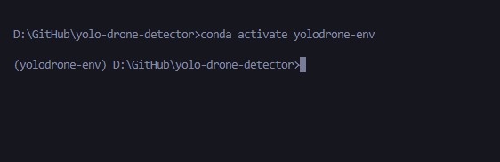
   
   - (Optional) **Remove** a Conda environment if needed:
      ```bash
      conda remove -n <env-name> --all
      ```
   2.5 Let's try to run `main.py` by following command:
      ```bash
      python src\main.py
      ```   
      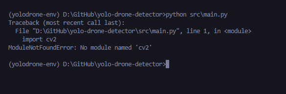
      (You should encounter an error: ModuleNotFoundError: No module named 'cv2')


3. Install dependencies from `requirements.txt`:
   - Check the location of `pip`:
      ```bash
      where pip
      ```
      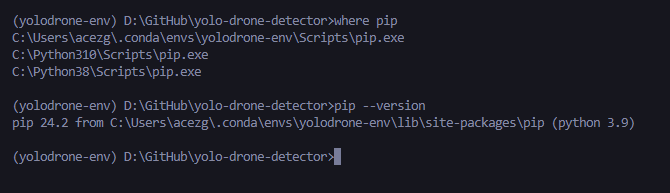
   - Install required dependencies listed in `requirements.txt`
      ```bash
      pip install -r requirements.txt
      ```
      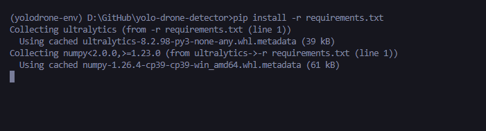
      (The download may take around 5-10 minutes.)
   - After dowloaded `requirements.txt`, Let's try to run `main.py` by following command:
      ```bash
      python src\main.py
      ```  
      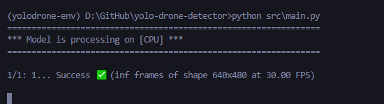
      (The model will process using the CPU.)


4. (Optional, for NVIDIA GPU users) Install PyTorch with CUDA support by following the instructions from the [PyTorch website](https://pytorch.org/get-started/locally/). 
For this workshop using PyTorch CUDA 11.7:
   - pip install `PyTorch` and it's dependencies using below:
      ```bash
      pip install torch torchvision torchaudio --index-url https://download.pytorch.org/whl/cu117
      ```
      

   - After pip installing `PyTorch with cu117 (CUDA 11.7)`, Let's try to run `main.py` by following command:
      ```bash
      python src\main.py
      ``` 
      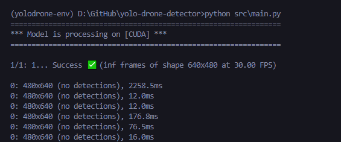
      (The model will process using the NVIDIA GPU.)

5. **(Optional) Export Conda Environment for Use on Another PC or Machine**
   To export your Conda environment so it can be easily recreated on another system
   - Export the environment
      ```bash
      conda env export > environment.yml
      ```

   - Recreating the environment
   (On another machine, you can recreate the environment using):
      ```bash
      conda env create -f environment.yml
      ```

   - Result of `environment.yml`
   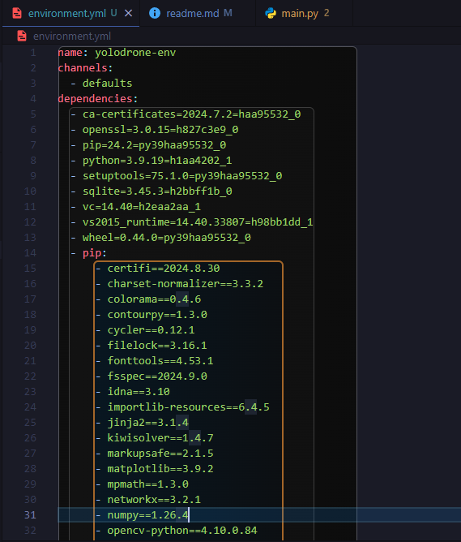
   This process allows you to set up the same environment, ensuring consistency and portability across different systems.

## #Step 5: TODO

Once the installation is complete, you can activate the environment using:

```bash
conda activate yolov8-env
```

Now you can use the `yolo` command to run YOLOv8:

```bash
yolo task=detect mode=predict model=yolov8n.pt source='path/to/your/image_or_video'
```

## Step 6: Verify Installation

To verify everything works fine, you can run a simple command to check if YOLOv8 is installed correctly:

```bash
python -c "import ultralytics; ultralytics.checks()"
```

If you get no errors, you are all set!

---


## Additional Resources
- [Ultralytics YOLOv8 Documentation](https://docs.ultralytics.com/)
- [CUDA Toolkit Documentation](https://docs.nvidia.com/cuda/)
