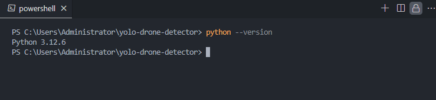
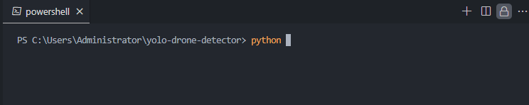
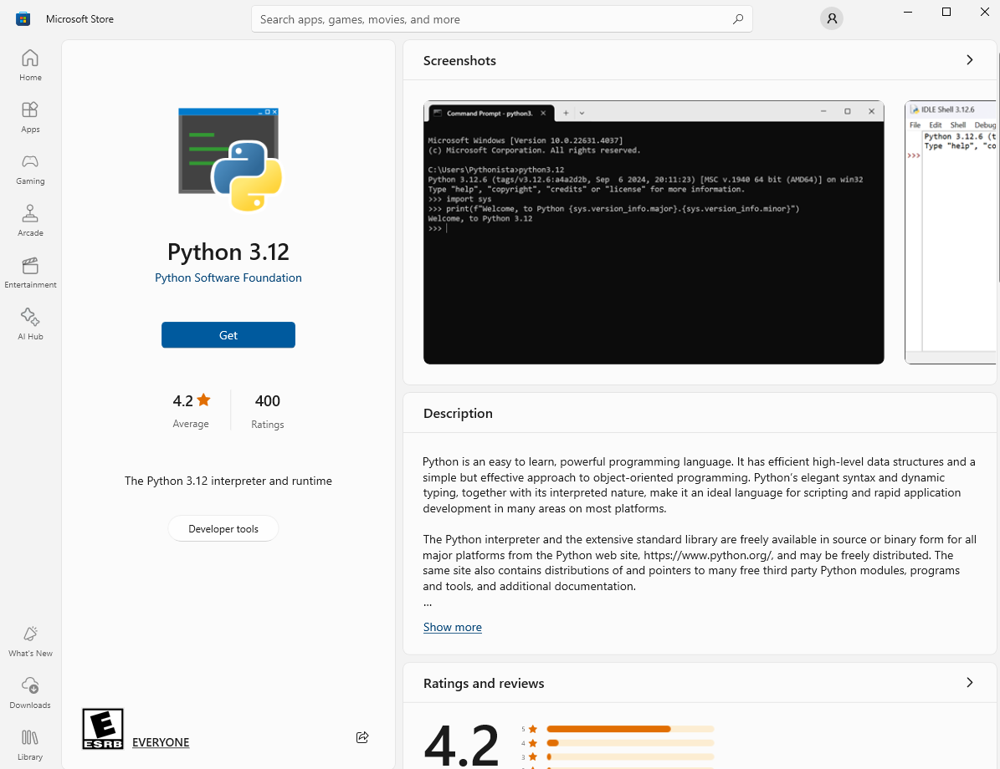

# ** Before readme **
Open VSCode -> Click Extension -> Search below -> Install
```bash
   Markdown Preview Enhanced
```
```bash
   Material Icon Theme
```
```bash
   Path Intellisense
```

# Ultralyitcs YOLO Setup and Installation
This guide provides detailed steps to set up and install Ultralyitcs YOLO with CUDA Toolkit 11.7 and Anaconda for virtual environment management.

## Prerequisites
Before you begin, ensure that you have:
- **Python 3.9.9** for AI Development
- **OBS** for Video Stream
- **NVIDIA GPU** with support for CUDA.
- **Anaconda** installed on your system (for virtual environment management).
- **CUDA Toolkit 11.7** installed.


## #Step 0: Install Python 3.12
- Open Console
- typing this in console
   ```
   python --version
   ```
   - If it found python version 3.12.x or any version 
      
      then Skip this **`#Step 0`** and go to **`#Step 1`**

   - But if not found any version, Typing this in console
      ```
      python
      ``` 
      
      and it will show **Python 3.12** on **Microsoft Store**
      
      - Click **Get** to download
      - after that re-checking Python version
      
      - Complete this **`#Step 0`** and go to **`#Step 1`**


## #Step 1: Install CUDA Toolkit 11.7
To leverage GPU acceleration, you need to install the CUDA Toolkit 11.7. Follow these steps:

1. Visit the [CUDA Toolkit 11.7 download page](https://developer.nvidia.com/cuda-11-7-0-download-archive) and select the version appropriate for your operating system.
   - select according to your pc or laptop
   
   - and 


2. Follow the installation instructions on the page. After installation, verify it by running:

   ```bash
      nvcc --version
   ```

   This should return details of CUDA 11.7 if the installation was successful.

## Step 2: Install Anaconda

Anaconda will help manage your virtual environments. You can install Anaconda by following these steps:

1. Download the installer from the [official Anaconda website](https://www.anaconda.com/download/success).
2. Run the installer and follow the on-screen instructions.
3. Verify the installation by running:

   ```bash
      conda --version
   ```

## Step 3: Set Up the YOLOv8 Virtual Environment

1. Download or clone the [Ultralytics YOLO repository](https://github.com/ultralytics/ultralytics):

   ```bash
   git clone https://github.com/ultralytics/ultralytics.git
   cd ultralytics
   ```

2. Create a new Anaconda environment and install dependencies from the `requirements.txt` file:

   ```bash
   conda create --name yolov8-env python=3.8
   conda activate yolov8-env
   ```

3. Install dependencies from `requirements.txt`:

   ```bash
   pip install -r requirements.txt
   ```

4. If you’re using GPU, install PyTorch with CUDA support by following the instructions from the [PyTorch website](https://pytorch.org/get-started/locally/). For example, for CUDA 11.7:

   ```bash
   pip install torch torchvision torchaudio --index-url https://download.pytorch.org/whl/cu117
   ```

## Step 4: Activate the Environment and Run YOLOv8

Once the installation is complete, you can activate the environment using:

```bash
conda activate yolov8-env
```

Now you can use the `yolo` command to run YOLOv8:

```bash
yolo task=detect mode=predict model=yolov8n.pt source='path/to/your/image_or_video'
```

## Step 5: Verify Installation

To verify everything works fine, you can run a simple command to check if YOLOv8 is installed correctly:

```bash
python -c "import ultralytics; ultralytics.checks()"
```

If you get no errors, you are all set!

---

## Additional Resources

- [Ultralytics YOLOv8 Documentation](https://docs.ultralytics.com/)
- [CUDA Toolkit Documentation](https://docs.nvidia.com/cuda/)
